# Recovery of Microbial Genomes from Metagenomes and their functional annotation

**This workshop covers the recovery of microbial genomes from metagenomics samples using [Metawrap](https://github.com/bxlab/metaWRAP/tree/master) and their functional annotation using [METABOLIC](https://github.com/AnantharamanLab/METABOLIC)**

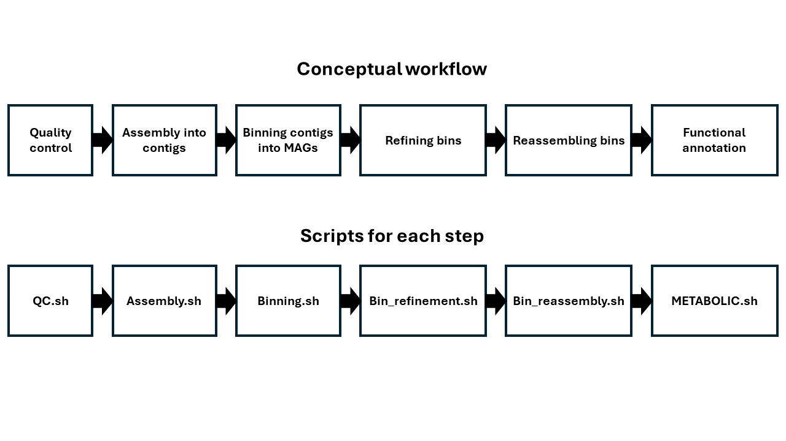

---
# Notes on using these materials

- **Code can be copied from code blocks using the button at the top right of each code block with a single click**

- **To paste code into your terminal, you will need to right click.**

- **You can check the status of your running jobs using:**
```bash
squeue --me
```

The first column of the output printed to the terminal will be the job identifier (JOBID). If you want to cancel your job, you can use:
```bash
scancel YOUR-JOB-ID
```
Obviously swapping 'YOUR-JOB-ID' for the actual job identifier.


## If you lose connection or get lost at any point

You can return to the directory we will be running all steps from using:
```bash
cd /uoa/scratch/users/"$USER"/UoA_Metagenomics_Workshop
```

---

# Setup

## Environments

In order to ensure that all the packages we need and their dependencies are installed, and so that versions required by each of the programs we are running do not conflict with eachother, we will be using `conda` to manage our 'environments'. 

### What is an environment

An environment in Conda is a self-contained directory that contains a specific collection of packages and dependencies. This means you can have multiple environments on your system, each tailored for a particular project or task, without interfering with each other.

Managing environments with `conda` ensures:
1. Isolation: Different projects can require different versions of the same package. Environments keep these separate to avoid conflicts.

2. Reproducibility: By using environments, you can easily share the exact setup used for a project, ensuring others can replicate your work precisely.

3. Organization: Environments help you keep your workspace clean and organized, making it easier to manage projects and dependencies.

### Environments for this workshop

**In addition to installing the packages and their dependencies, MetaWRAP and METABOLIC are a bit complicated and rely on setting some paths to databases as well as running some setup scripts, which would take too long to do here. We will be using some pre-configured environments in this workshop that have everything you need to run these tools.**


## Load Miniconda3

Miniconda3 is a minimal installation of conda that is available on Maxwell as a module. We can load it using:
```bash
module load miniconda3
```

We can then ensure that miniconda is available every time we log in by running:
```bash
conda init bash
```
and
```bash
source ~/.bashrc
```


*Note: If you already have a way of using conda on Maxwell that you are happy with, and you are confident enough to fix any conda-related issues that might arise during the use of the materials below, then feel free to skip the above steps.*


## Check the environments are set up correctly

Although we are providing pre-configured environments, we should check to make sure they are working properly for you and can find the databases required.

### Check Metawrap environment

A Metawrap environment is provided for this training at `/uoa/scratch/shared/Soil_Microbiology_Group/Training/Metagenomics/envs/Metawrap-v1.3.2`. You can activate it using:
```bash
conda activate /uoa/scratch/shared/Soil_Microbiology_Group/Training/Metagenomics/envs/Metawrap-v1.3.2
```

You should see the environment (in brackets) before your username in the command prompt change as below:
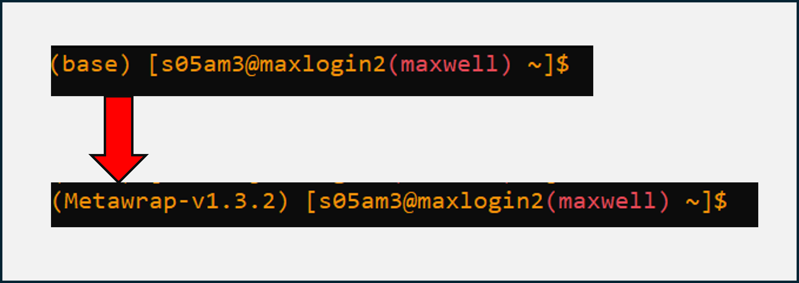

Now we need to check that the paths to the databases are configured properly. Verify that the output of:
```bash
echo $BLASTDB
```
matches:
> /uoa/scratch/shared/Soil_Microbiology_Group/Training/Metagenomics/databases/NCBI_nt

and that the output of:
```bash
echo $TAXDUMP
```
matches:
> /uoa/scratch/shared/Soil_Microbiology_Group/Training/Metagenomics/databases/NCBI_tax

If it does, then Metawrap is ready to be used.

**Deactivate the environment using:**
```bash
conda deactivate
```


### Check METABOLIC environment

A Metawrap environment is provided for this training at `/uoa/scratch/shared/Soil_Microbiology_Group/Training/Metagenomics/envs/METABOLIC-v4.0`. You can activate it using:
```bash
conda activate /uoa/scratch/shared/Soil_Microbiology_Group/Training/Metagenomics/envs/METABOLIC-v4.0
```

You should see the environment (in brackets) before your username in the command prompt change as below:
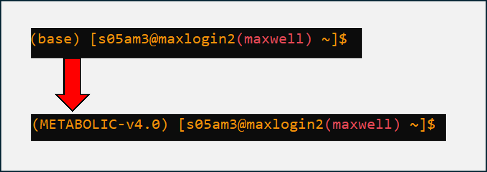

Now we need to check that the paths to the databases are configured properly. Verify that the output of:
```bash
echo $GTDBTK_DATA_PATH
```
matches:
> /uoa/scratch/shared/Soil_Microbiology_Group/Training/Metagenomics/databases/GTDB-Tk_r220

and the output of:
```bash
echo $GTDB_DATA_PATH
```
matches:
> /uoa/scratch/shared/Soil_Microbiology_Group/Training/Metagenomics/databases/GTDB-Tk_r220

If it does, then METABOLIC is ready to be used.

**Deactivate the environment using:**
```bash
conda deactivate
```

## Clone (copy) this repository to your own space on Maxwell

This will give you environment files and the scripts needed to run the analysis (which will be uploaded AFTER the workshop, to force you to write them yourself for now.)

Navigate to somewhere sensible:
```bash
cd /uoa/scratch/users/"$USER"
```
*Note: you do not need to change "$USER" here, this will automatically use your correct username.*


Clone the repository using:
```bash
git clone https://github.com/biomoff/UoA_Metagenomics_Workshop
```


---

# 0. Get the Raw Data

A small metagenomics dataset has been prepared for this workshop. Navigate to the workshop folder
```bash
cd /uoa/scratch/users/"$USER"/UoA_Metagenomics_Workshop
```

and link the raw data:
```bash
ln -s /uoa/scratch/shared/Soil_Microbiology_Group/Training/Metagenomics/0_RAW-READS 0_RAW-READS
```

You should now have a directory called `0_RAW-READS` containing some metagenomics sequence files:

> A_1.fastq  
> A_2.fastq  
> B_1.fastq  
> B_2.fastq  


These are the forward (`_1`) and reverse (`_2`) reads for 2 metagenome samples (`A` and `B`). You can imagine these as being, for example, 2 different soil samples or samples from 2 different patients.


Verify that what you have matches the above:
```bash
ls -l 0_RAW-READS/
```

*If it matches, you can now begin the pipeline, starting with some quality control*

---

# 1. Quality Control using Metawrap's Read QC module

Before we can proceed with any sort of analysis, we need to do some quality control on the data we have.

We will be using the `read_qc` module of Metawrap to trim the reads. Often you might want to remove reads from a host (e.g. human), but we will be skipping that step here for simplicity as it is not required in our dataset. If you need to do it on your own data, you can find the information [here](https://github.com/bxlab/metaWRAP/blob/master/Usage_tutorial.md).


## Making the QC.sh submission script
We need to create the `QC.sh` script to run read trimming on our two samples. Start by creating and opening this file in the `Scripts` subdirectory:
```bash
module load nano
nano Scripts/QC.sh
```

You should now be inside an open empty file, which we will gradually add to in order to build up our submission script for read QC.

### Adding Slurm scheduler parameters

We need to tell the Slurm scheduler how much resource we want to allocate to the job. The following parameters have been optimised for this dataset. Add them to your open `QC.sh` file by copying and pasting:
```bash
#!/bin/bash

#SBATCH --partition=uoa-compute
#SBATCH --time=01:00:00
#SBATCH --cpus-per-task=2
#SBATCH --mem-per-cpu=2G
#SBATCH --mail-type=ALL
#SBATCH --mail-user=


```
*note: add in your email address after `mail-user=` in order to get email updates for the job*

### Adding some description of the version the script was written for

It is also good practice to note which version of the package you are using the script was written for, in the event that a newer version becomes available. You can add something like the below which will be useful if you use the script later or send it to somebody else to use. Copy and paste it into your open file:
```bash
### This was written for metawrap version 1.3.2 ###


```

### Adding code for loading miniconda and activating the correct environment
Next, we need to make sure that our job is using the environment that we made, so that it has access to Metawrap. Add the below to your open file:
```bash
## Source miniconda3 installation and activate environment

source /opt/software/uoa/apps/miniconda3/latest/etc/profile.d/conda.sh
conda activate /uoa/scratch/shared/Soil_Microbiology_Group/Training/Metagenomics/envs/Metawrap-v1.3.2


```


### Adding code to set the input and output directories
It is also useful to be able to see at the top of the file what the input and output directories that the script will look for files in / output files to. This means that if you want to change the name of the output directory you only need to do it once at the top by changing the variable, and it will automatically apply to the whole script. Add the below to your open file:
```bash
## Set directory and file name variables

InputDir=0_RAW-READS
OutputDir=1_READ-QC


```
*note: avoid changing the names here, as the rest of this workshop will reference these directories specifically.*

### Add code to make the output directories

```bash
## Make output directories

mkdir -p "$OutputDir"

```


### Adding the code to run Metawrap's QC module

Finally you can add the code to use Metawrap to perform read trimming on your samples:
```bash
## QC and trim raw reads:

metawrap read_qc -1 "$InputDir"/A_1.fastq -2 "$InputDir"/A_2.fastq -t 2 -o "$OutputDir"/A --skip-bmtagger
metawrap read_qc -1 "$InputDir"/B_1.fastq -2 "$InputDir"/B_2.fastq -t 2 -o "$OutputDir"/B --skip-bmtagger


```

This will read in the forward reads (`-1`) and the reverse reads (`-2`) from your samples, use 2 cpu threads (`-t 2`) to perform the read QC, and then send the output files to your specified output directory (`-o`). We have used the `--skip-bmtagger` flag to skip removal of host sequences.

**Save the file by using Ctrl+o, hit Enter, then close the file using Ctrl+x.**

## Running the QC.sh script

You can now run the script as below:
```bash
sbatch Scripts/QC.sh
```

This should take roughly 20-25 minutes to run.

If it does not run within the allocated time, view your job using `squeue --me` to find the JOBID, and cancel the job using `scancel JOBID`.

remove the incomplete output folder using:
```bash
rm -rf 1_READ-QC
```

and link to the example output provided using:
```bash
ln -s /uoa/scratch/shared/Soil_Microbiology_Group/Training/Metagenomics/output/1_READ-QC 1_READ-QC
```

## Inspecting the output of Metawrap's QC module

You should, once it finishes running, have an output directory called `1_READ-QC` that contains two subdirectories, `A` and `B`. These will each contain 2 files `final_pure_reads_1.fastq` and `final_pure_reads_2.fastq` for the trimmed forward and reverse reads respectively, and some output directories with QC reports: `pre-QC_report` and `post-QC_report`. Verify that you have these outputs using:
```bash
ls -l 1_READ-QC/A
ls -l 1_READ-QC/B
```

Within `pre-QC_report` and `post-QC_report` you would find:
> final_pure_reads_1_fastqc.html  
> final_pure_reads_2_fastqc.html  

These QC report HTML files can be inspected by copying them over to your own machine (using WinSCP or other methods) and viewing them in a browser. We will skip that with our data for now, but below is an example of what you might expect to see:

pre-QC reads:
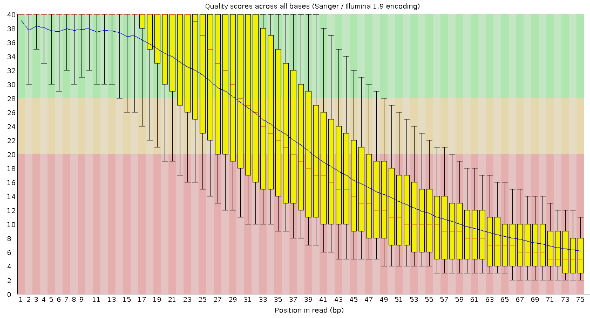

post-QC reads:
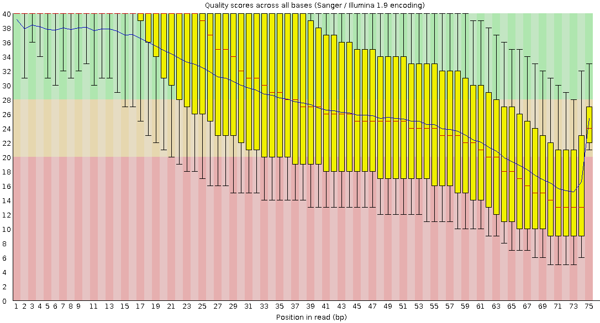

---

# 2. Assembling the reads into Contigs using Metawrap's Assembly module


Now that we have high quality reads, we need to assemble them into contigs using Metawrap's `assembly` module.

Depending on your study, you might want to assemble the reads from all samples together, or separately. If, for example, you have multiple replicates from a single sample (e.g. a particular soil), it may be of use to coassemble all those samples together. In our case we will stick with assembling our samples individually. 

Metawrap offers 2 different assembly algorithms, [MetaSPADES](https://doi.org/10.1101/gr.213959.116) and [Megahit](https://doi.org/10.1093/bioinformatics/btv033). MetaSPADES is usually recommended for all but large datasets, but we will use Megahit here to reduce computational burden.


## Making the Assembly.sh submission script

We need to create the `Assembly.sh` script to assemble our two samples. Start by creating and opening this file in the `Scripts` subdirectory:
```bash
nano Scripts/Assembly.sh
```

You should now be inside an open empty file, which we will gradually add to in order to build up our submission script for assembly of reads into contigs.

### Adding Slurm scheduler parameters

We need to tell the Slurm scheduler how much resource we want to allocate to the job. The following parameters have been optimised for this dataset. Add them to your open `Assembly.sh` file by copying and pasting:
```bash
#!/bin/bash

#SBATCH --partition=uoa-compute
#SBATCH --time=01:00:00
#SBATCH --cpus-per-task=16
#SBATCH --mem-per-cpu=250M
#SBATCH --mail-type=ALL
#SBATCH --mail-user=


```
*note: add in your email address after `mail-user=` in order to get email updates for the job*

### Adding some description of the version the script was written for

It is also good practice to note which version of the package you are using the script was written for, in the event that a newer version becomes available. You can add something like the below which will be useful if you use the script later or send it to somebody else to use. Copy and paste it into your open file:
```bash
### This was written for metawrap version 1.3.2 ###


```

### Adding code for loading miniconda and activating the correct environment
Next, we need to make sure that our job is using the environment that we made, so that it has access to Metawrap. Add the below to your open file:
```bash
## Source miniconda3 installation and activate environment

source /opt/software/uoa/apps/miniconda3/latest/etc/profile.d/conda.sh
conda activate /uoa/scratch/shared/Soil_Microbiology_Group/Training/Metagenomics/envs/Metawrap-v1.3.2


```


### Adding code to set the input and output directories
As above, add the below to your open file:
```bash
## Set directory and file name variables

InputDir=1_READ-QC
OutputDir=2_ASSEMBLY


```
*note: avoid changing the names here, as the rest of this workshop will reference these directories specifically.*

### Add code to make the output directories

```bash
## Make output directories

mkdir -p "$OutputDir"/A
mkdir -p "$OutputDir"/B


```

### Add code to assemble the reads into contigs using Metawrap's Assembly module

We want to run the assembly module individually on each sample, so we will do that by adding the following:
```bash
## Assemble contigs for sample A using metawrap assembly:

metawrap assembly -1 "$InputDir"/A/final_pure_reads_1.fastq -2 "$InputDir"/A/final_pure_reads_2.fastq -m 4 -t 16 --megahit -o "$OutputDir"/A

## Assemble contigs for sample B using metawrap assembly:

metawrap assembly -1 "$InputDir"/B/final_pure_reads_1.fastq -2 "$InputDir"/B/final_pure_reads_2.fastq -m 4 -t 16 --megahit -o "$OutputDir"/B


```

This will take in the trimmed forward reads `-1` and the trimmed reverse reads `-2`, tell the assembler how much memory we have allocated `-m 4` (4 GB) and how many CPU threads to use `-t 16`, to use the megahit assembly algorithm `--megahit`, and where to send the output `-o`. There is the option to change the minimum length of assembled contigs to output, `-l`, but we will leave it at the default of 1000 bp.

**Save the file by using Ctrl+o, hit Enter, then close the file using Ctrl+x.**


## Running the Assembly.sh script

You can now run the script as below:
```bash
sbatch Scripts/Assembly.sh
```

It should take about 25-30 minutes to run.

If it does not run within the allocated time, view your job using `squeue --me` to find the JOBID, and cancel the job using `scancel JOBID`.

remove the incomplete output folder using:
```bash
rm -rf 2_ASSEMBLY
```

and link to the example output provided using:
```bash
ln -s /uoa/scratch/shared/Soil_Microbiology_Group/Training/Metagenomics/output/2_ASSEMBLY 2_ASSEMBLY
```

## Inspecting the output of Metawrap's assembly module

Once `Assembly.sh` has finished running, you should have a subdirectory called `2_ASSEMBLY` that contains subdirectories `A` and `B`. Each of these will contain 2 output files and 2 directories containing intermediate files:

> QUAST_out  
> assembly_report.html  
> final_assembly.fasta  
> megahit  

`megahit` and `QUAST_out` contain intermediate files. `final_assembly.fasta` is the final assembly file containing the contigs and `assembly_report.html` is the assembly report generated by QUAST.

Verify that you have these files for both samples A and B by running:
```bash
ls -l 2_ASSEMBLY/A
ls -l 2_ASSEMBLY/B
```

The full assembly report can be inspected by transferring it to your own machine (using WinSCP or other methods) and viewing it in a browser. The report will contain some statistics about the assembly as well as some handy plots of cumulative assembly size by number of contigs, and the size of the contigs in descending order, as well as GC content:
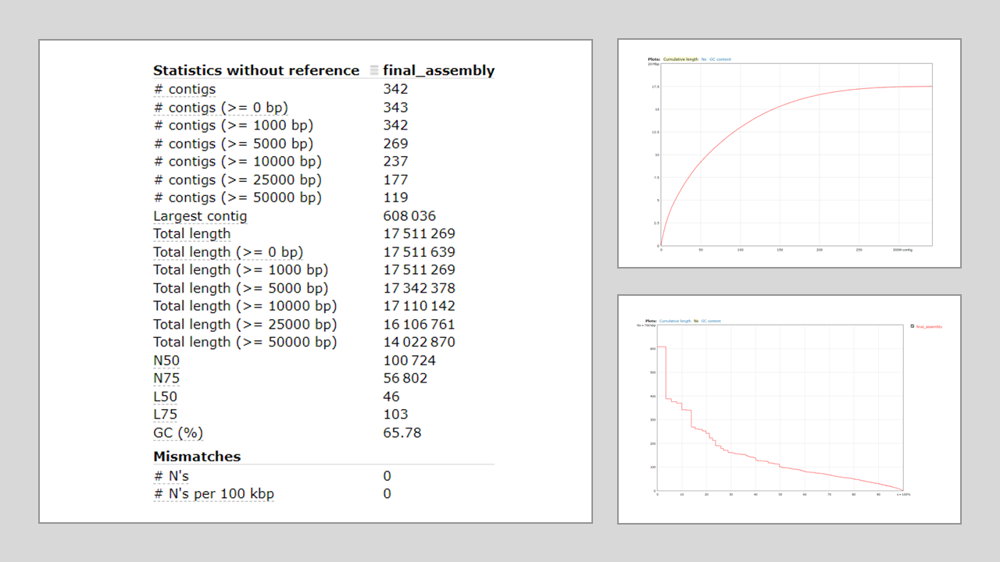

However, we will just quickly inspect the output here on the command line. Copy and paste the below into the command line:
```bash
tail -n 9 2_ASSEMBLY/A/QUAST_out/report.txt
tail -n 9 2_ASSEMBLY/B/QUAST_out/report.txt
```

You should get an output that looks like this for sample A:
> \# contigs                   345  
> Largest contig              608195  
> Total length                17514579  
> GC (%)                      65.77  
> N50                         100354  
> N75                         56802  
> L50                         47  
> L75                         105  
> \# N's per 100 kbp           0.00  

and like this for sample B:
> \# contigs                   355  
> Largest contig              393717  
> Total length                16614804  
> GC (%)                      63.61  
> N50                         93956  
> N75                         54588  
> L50                         55  
> L75                         113  
> \# N's per 100 kbp           0.00  

**Now that we have assembled our reads into contigs, it is time to bin the contigs into different bins to make Metagenome Assembled Genomes (MAGs)**

---

# 3. Binning into MAGs using Metawrap's Binning module

Binning is a crucial step in assembling MAGs from metagenomics data, and involves the placing of contigs into different bins based on taxonomy-informed or taxonomic indepedent methods. Taxonomic indepedent methods use GC content, K-mer frequencies, read depth, and co-variation of abundance across different samples to assign contigs to bins. Here we will be using [Maxbin2](https://doi.org/10.1093/bioinformatics/btv638), which uses tetranucleotide frequences, and [MetaBAT2](https://doi.org/10.7717/peerj.7359), which uses a graph-based approach on contig similarity.

*Note: It is useful to remember that these bins often represent a collection of closely related taxa. 1 MAG != 1 genome from 1 organism.*


Metawrap uses multiple different binning algorithms and combines their output to yield more accurate bins:
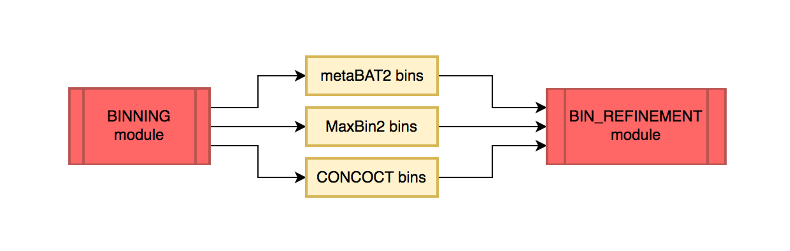


**We will now write the submission script to run Metawrap's Binning module.**


## Making the Binning.sh submission script

We need to create the `Binning.sh` script to assemble our two samples. Start by creating and opening this file in the `Scripts` subdirectory:
```bash
nano Scripts/Binning.sh
```

You should now be inside an open empty file, which we will gradually add to in order to build up our submission script for assigning contigs to different bins.

### Adding Slurm scheduler parameters

We need to tell the Slurm scheduler how much resource we want to allocate to the job. The following parameters have been optimised for this dataset. Add them to your open `Binning.sh` file by copying and pasting:
```bash
#!/bin/bash

#SBATCH --partition=uoa-compute
#SBATCH --time=01:00:00
#SBATCH --cpus-per-task=4
#SBATCH --mem-per-cpu=1G
#SBATCH --mail-type=ALL
#SBATCH --mail-user=


```
*note: add in your email address after `mail-user=` in order to get email updates for the job*

### Adding some description of the version the script was written for

It is also good practice to note which version of the package you are using the script was written for, in the event that a newer version becomes available. You can add something like the below which will be useful if you use the script later or send it to somebody else to use. Copy and paste it into your open file:
```bash
### This was written for metawrap version 1.3.2 ###


```

### Adding code for loading miniconda and activating the correct environment
Next, we need to make sure that our job is using the environment that we made, so that it has access to Metawrap. Add the below to your open file:
```bash
## Source miniconda3 installation and activate environment

source /opt/software/uoa/apps/miniconda3/latest/etc/profile.d/conda.sh
conda activate /uoa/scratch/shared/Soil_Microbiology_Group/Training/Metagenomics/envs/Metawrap-v1.3.2


```


### Adding code to set the input and output directories
As above, add the below to your open file:
```bash
## Set directory and file name variables

Reads=1_READ-QC
Assembly=2_ASSEMBLY
OutputDir=3_INITIAL-BINNING


```
*note: avoid changing the names here, as the rest of this workshop will reference these directories specifically.*

### Add code to make the output directories

```bash
## Make output directories

mkdir -p "$OutputDir"/A
mkdir -p "$OutputDir"/B


```

### Add code to assign the contigs to bins using Metawrap's binning module

We want to run the assembly module individually on each sample, so we will do that by adding the following:
```bash
## Bin contigs using Metawrap binning for sample A

metawrap binning -o "$OutputDir"/A -t 4 -a "$Assembly"/A/final_assembly.fasta --metabat2 --maxbin2 --universal "$Reads"/A/*_1.fastq "$Reads"/A/*_2.fastq

## Bin contigs using Metawrap binning for sample B

metawrap binning -o "$OutputDir"/B -t 4 -a "$Assembly"/B/final_assembly.fasta --metabat2 --maxbin2 --universal "$Reads"/B/*_1.fastq "$Reads"/B/*_2.fastq


```

Here we are using Metawrap's `binning` module to bin contigs, specifying the number of threads (`-t 4`), the location of the assembly file (`-a`), which binning algorithms to use (`--metabat2 --maxbin2`), and to use universal marker genes rather than just bacterial marker genes (`--universal`) which improves archaeal binning. We then specify that path to the raw reads as positional arguments at the end. There are other options that can be set, but we have left those with the defaults. For your own data, you can check them using `metawrap binning --help`.

**Save the file by using Ctrl+o, hit Enter, then close the file using Ctrl+x.**

## Running the Binning.sh script

You can now run the script as below:
```bash
sbatch Scripts/Binning.sh
```

It should take about 15-20 minutes to run.

If it does not run within the allocated time, view your job using `squeue --me` to find the JOBID, and cancel the job using `scancel JOBID`.

remove the incomplete output folder using:
```bash
rm -rf 3_INITIAL-BINNING
```

and link to the example output provided using:
```bash
ln -s /uoa/scratch/shared/Soil_Microbiology_Group/Training/Metagenomics/output/3_INITIAL-BINNING 3_INITIAL-BINNING
```

## Inspecting the output of Metawrap's Binning module

You should now have a directory called `3_INITIAL-BINNING` that contains subdirectories `A` and `B`, which will each contain a subdirectory for each of the binning methods and a subdirectory with intermediate files:
> maxbin2_bins  
> metabat2_bins  
> work_files

Verify you have these using:
```bash
ls -l 3_INITIAL-BINNING/A
ls -l 3_INITIAL-BINNING/B
```

Within each of these you should have the fasta format files of the various bins contigs have been assigned to, e.g. for sample A:
```bash
ls -l 3_INITIAL-BINNING/A/maxbin2_bins
```
> bin.0.fa  
> bin.1.fa  
> bin.2.fa

```bash
ls -l 3_INITIAL-BINNING/A/metabat2_bins
```
> bin.1.fa  
> bin.2.fa  
> bin.3.fa  
> bin.unbinned.fa

**We will refine these in the next step to consolidate the results of the 2 different binners.**

---

# 4. Refining bins using Metawrap's Bin Refinement module

**As we mentioned above, Metawrap uses multiple binners and then combines their output to create consolidated bins that are better than those produced by any single algorithm. We will use Metawrap's `bin_refinement` module to do this.**

## Making the .sh submission script

We need to create the `Bin_refinement.sh` script to assemble our two samples. Start by creating and opening this file in the `Scripts` subdirectory:
```bash
nano Scripts/Bin_refinement.sh
```

You should now be inside an open empty file, which we will gradually add to in order to build up our submission script for the refinement of the various bin sets.

### Adding Slurm scheduler parameters

We need to tell the Slurm scheduler how much resource we want to allocate to the job. The following parameters have been optimised for this dataset. Add them to your open `Bin_refinement.sh` file by copying and pasting:
```bash
#!/bin/bash

#SBATCH --partition=uoa-compute
#SBATCH --time=02:00:00
#SBATCH --cpus-per-task=4
#SBATCH --mem-per-cpu=12G
#SBATCH --mail-type=ALL
#SBATCH --mail-user=


```
*note: add in your email address after `mail-user=` in order to get email updates for the job*

### Adding some description of the version the script was written for

It is also good practice to note which version of the package you are using the script was written for, in the event that a newer version becomes available. You can add something like the below which will be useful if you use the script later or send it to somebody else to use. Copy and paste it into your open file:
```bash
### This was written for metawrap version 1.3.2 ###


```

### Adding code for loading miniconda and activating the correct environment
Next, we need to make sure that our job is using the environment that we made, so that it has access to Metawrap. Add the below to your open file:
```bash
## Source miniconda3 installation and activate environment

source /opt/software/uoa/apps/miniconda3/latest/etc/profile.d/conda.sh
conda activate /uoa/scratch/shared/Soil_Microbiology_Group/Training/Metagenomics/envs/Metawrap-v1.3.2


```


### Adding code to set the input and output directories

As above, add the below to your open file:
```bash
## Set directory and file name variables

Reads=1_READ-QC
Bins=3_INITIAL-BINNING
OutputDir=4_BIN-REFINEMENT


```
*note: avoid changing the names here, as the rest of this workshop will reference these directories specifically.*

### Add code to make the output directories

```bash
## Make output directories

mkdir -p "$OutputDir"/A
mkdir -p "$OutputDir"/B


```

### Add code to refine the bins from different methods using Metawrap's bin_refinement module

We want to run the assembly module individually on each sample, so we will do that by adding the following:
```bash
## Run Metawrap's bin refinement module for sample A

metawrap bin_refinement -o "$OutputDir"/A -t 4 -A "$Bins"/A/metabat2_bins/ -B "$Bins"/A/maxbin2_bins/ -c 50 -x 10

## Run Metawrap's bin refinement module for sample B

metawrap bin_refinement -o "$OutputDir"/B -t 4 -A "$Bins"/B/metabat2_bins/ -B "$Bins"/B/maxbin2_bins/ -c 50 -x 10


```

Here, we are using Metawrap's `bin_refinement` module to take in the multiple bin sets and consolidate them into final improved bins. Here we are only using MetaBAT2 (`-A`) and Maxbin2 (`-B`) bin sets to consolidate. If we had run binning with CONCOCT, we could also supply that using `-C <path-to-concoct-bins>`. It is actually possible to supply bins produced using anything binning algorithm you like. Consult the [documentation](https://github.com/bxlab/metaWRAP/blob/master/Usage_tutorial.md) if this is something you want to do with your own data. We have also specified the number of threads to use (`-t 4`), and where to send the output (`-o`). Finally, we have used the `-c` and `-x` flags to set thresholds for completeness and contamination, which can be tailored for your own data depending on your needs. This uses the proportion of expected single copy genes that are present (completeness), and the proportion of expected single copy genes that are present more than once (contamination) in each bin. 


**Save the file by using Ctrl+o, hit Enter, then close the file using Ctrl+x.**

## Running the Bin_refinement.sh script

You can now run the script as below:
```bash
sbatch Scripts/Bin_refinement.sh
```

If it does not run within the allocated time, view your job using `squeue --me` to find the JOBID, and cancel the job using `scancel JOBID`.

remove the incomplete output folder using:
```bash
rm -rf 4_BIN-REFINEMENT
```

and link to the example output using:
```bash
ln -s /uoa/scratch/shared/Soil_Microbiology_Group/Training/Metagenomics/output/4_BIN-REFINEMENT 4_BIN-REFINEMENT
```

## Inspecting the output of Metawrap's bin refinement module

This step will produce various outputs and intermediate files in the `4_Bin-refinement` directory:

> figures  
> maxbin2_bins  
> maxbin2_bins.contigs  
> maxbin2_bins.stats  
> metabat2_bins  
> metabat2_bins.contigs  
> metabat2_bins.stats  
> metawrap_50_10_bins  
> metawrap_50_10_bins.contigs  
> metawrap_50_10_bins.stats  
> work_files

verify that what you have matches the above:
```bash
ls -l 4_BIN-REFINEMENT/A
ls -l 4_BIN-REFINEMENT/B
```


`metawrap_50_10_bins` contains the actual bins (MAGs) that were produced by the module:
> bin.1.fa  
> bin.2.fa  
> bin.3.fa

Verify that you have the same number of bins:
```bash
ls -l 4_BIN-REFINEMENT/A/metawrap_50_10_bins
ls -l 4_BIN-REFINEMENT/B/metawrap_50_10_bins
```

You can also check `metawrap_50_10_bins.stats` to see the statistics and taxonomy of the bins:

```bash
cat 4_BIN-REFINEMENT/A/metawrap_50_10_bins.stats
```
> bin     completeness    contamination   GC      lineage N50     size    binner  
> bin.1   99.57   0.0     0.722   Streptomycetaceae       80779   8364312 binsA  
> bin.3   99.45   0.0     0.554   Cyanobacteria   369767  2665800 binsA  
> bin.2   98.82   1.014   0.616   Pseudomonas     117668  5996447 binsAB  

```bash
cat 4_BIN-REFINEMENT/B/metawrap_50_10_bins.stats
```
> bin     completeness    contamination   GC      lineage N50     size    binner  
> bin.2   100.0   0.0     0.310   Euryarchaeota   115106  1846511 binsB  
> bin.1   99.57   0.0     0.722   Streptomycetaceae       80779   8365551 binsA  
> bin.3   98.82   1.044   0.616   Pseudomonas     119255  6026060 binsA  

*Note: this is a synthetic metagenome constructed from multiple individually sequenced genomes, so the completeness and contamination will be far better than you are likely to generate working on your own data. Do not be concerned if your own results do not look this good.*


**Now that we consolidated the multiple bin sets from different binners, and gotten an idea of the different taxa / genomes in our samples, we can go ahead and reassemble the reads on a per-bin basis to improve them further.**

---

# 5. Reassembling bins using Metawrap's Reassemble_bins module

The consolidated bin set can be further improved in a lot of cases by reassembling the bins by collecting the reads belonging to each bin, then reassembling them separately. We will use Metawrap's `reassemble_bins` module to accomplish this.

*Note: in the event that reassembling the bins does not improve the result, metawrap defaults to the original bin.*


## Making the Bin_reassembly.sh submission script

We need to create the `Bin_reassembly.sh` script to assemble our two samples. Start by creating and opening this file in the `Scripts` subdirectory:
```bash
nano Scripts/Bin_reassembly.sh
```

You should now be inside an open empty file, which we will gradually add to in order to build up our submission script for reassembling bins.

### Adding Slurm scheduler parameters

We need to tell the Slurm scheduler how much resource we want to allocate to the job. The following parameters have been optimised for this dataset. Add them to your open `Bin_reassembly.sh` file by copying and pasting:
```bash
#!/bin/bash

#SBATCH --partition=uoa-compute
#SBATCH --time=10:00:00
#SBATCH --cpus-per-task=16
#SBATCH --mem-per-cpu=4G
#SBATCH --mail-type=ALL
#SBATCH --mail-user=


```
*note: add in your email address after `mail-user=` in order to get email updates for the job*

### Adding some description of the version the script was written for

It is also good practice to note which version of the package you are using the script was written for, in the event that a newer version becomes available. You can add something like the below which will be useful if you use the script later or send it to somebody else to use. Copy and paste it into your open file:
```bash
### This was written for metawrap version 1.3.2 ###


```

### Adding code for loading miniconda and activating the correct environment
Next, we need to make sure that our job is using the environment that we made, so that it has access to Metawrap. Add the below to your open file:
```bash
## Source miniconda3 installation and activate environment

source /opt/software/uoa/apps/miniconda3/latest/etc/profile.d/conda.sh
conda activate /uoa/scratch/shared/Soil_Microbiology_Group/Training/Metagenomics/envs/Metawrap-v1.3.2


```


### Adding code to set the input and output directories
As above, add the below to your open file:
```bash
## Set directory and file name variables

Reads=1_READ-QC
Bins=4_BIN-REFINEMENT
OutputDir=5_BIN-REASSEMBLY


```
*note: avoid changing the names here, as the rest of this workshop will reference these directories specifically.*

### Add code to make the output directories

```bash
## Make output directories

mkdir -p "$OutputDir"/A
mkdir -p "$OutputDir"/B


```

### Add code to reassemble the reads into contigs using Metawrap's reassemble_bins module

We want to run the assembly module individually on each sample, so we will do that by adding the following:
```bash
## Run Metawrap's bin reassembly module for sample A

metawrap reassemble_bins -o "$OutputDir"/A -1 "$Reads"/A/final_pure_reads_1.fastq -2 "$Reads"/A/final_pure_reads_2.fastq -t 16 -m 64 -c 50 -x 10 -b "$Bins"/A/metawrap_50_10_bins

## Run Metawrap's bin reassembly module for sample B

metawrap reassemble_bins -o "$OutputDir"/B -1 "$Reads"/B/final_pure_reads_1.fastq -2 "$Reads"/B/final_pure_reads_2.fastq -t 16 -m 64 -c 50 -x 10 -b "$Bins"/B/metawrap_50_10_bins


```

Here we are using Metawrap's `reassemble_bins` module to reassemble the forward (`-1`) and reverse (`-2`) reads using 16 threads (`-t 16`) and 64GB memory (`-m 64`) based on the refined bins (`-b`). We are also specifying the bin completion (`-c 50`) and contamination (`-x 10`) thresholds the same as for the original binning, and specifying where the output should go (`-o`).

**Save the file by using Ctrl+o, hit Enter, then close the file using Ctrl+x.**

## Running the Bin_reassembly.sh script

You would now be able to run the script using `sbatch Scripts/Bin_reassembly.sh`, but it would take too long to do within the session.

You can find the example results at `/uoa/scratch/shared/Soil_Microbiology_Group/Training/Metagenomics/output/5_BIN-REASSEMBLY`, and link to them in your own directory using:

```bash
ln -s /uoa/scratch/shared/Soil_Microbiology_Group/Training/Metagenomics/output/5_BIN-REASSEMBLY 5_BIN-REASSEMBLY
```

## Inspecting the output of Metawrap's bin_reassembly module

You should now have directory called `5_BIN-REASSEMBLY` that contains the subdirectories `A` and `B`. Within each of these you will have the following:
> original_bins  
> original_bins.stats  
> reassembled_bins  
> reassembled_bins.checkm  
> reassembled_bins.png  
> reassembled_bins.stats  
> reassembly_results.eps  
> reassembly_results.png  
> total.faa  
> work_files  

Within `reassembled_bins.stats` you will find which version of each bin was used and the associated statistics:
```bash
cat 5_BIN-REASSEMBLY/A/reassembled_bins.stats  
```
> bin     completeness    contamination   GC      lineage N50     size  
> bin.1.orig      99.57   0.0     0.722   Streptomycetaceae       80779   8364312  
> bin.2.strict    99.72   0.0     0.554   Cyanobacteria   406760  2668992  
> bin.3.orig      98.82   1.014   0.616   Pseudomonas     112980  5996052  

```bash
cat 5_BIN-REASSEMBLY/B/reassembled_bins.stats  
```
> bin     completeness    contamination   GC      lineage N50     size  
> bin.1.permissive        99.91   2.275   0.615   Pseudomonas     190794  6235225  
> bin.2.permissive        99.57   0.0     0.722   Streptomycetaceae       90075   8377728  
> bin.3.permissive        100.0   0.0     0.310   Euryarchaeota   194754  1850953  

You can see that for bin 2 in sample A, and all bins in sample B, reassembly improved the quality of the bins. *Note: the results are not 100% reproducible from run to run, and your output may differ slightly if you run this yourself.*


You can find the final bin files in fasta format (and some other formats), in the `reassembled_bins` subdirectory:
```bash
ls -l 5_BIN-REASSEMBLY/A/reassembled_bins/*.fa
```
> BIN_REASSEMBLY/A/reassembled_bins/bin.1.orig.fa  
> BIN_REASSEMBLY/A/reassembled_bins/bin.2.strict.fa  
> BIN_REASSEMBLY/A/reassembled_bins/bin.3.orig.fa

```bash
ls -l 5_BIN-REASSEMBLY/B/reassembled_bins/*.fa
```
> BIN_REASSEMBLY/B/reassembled_bins/bin.1.permissive.fa  
> BIN_REASSEMBLY/B/reassembled_bins/bin.2.permissive.fa  
> BIN_REASSEMBLY/B/reassembled_bins/bin.3.permissive.fa  

**These are our MAGs that we can now use for downstream analysis.**

--- 

# 6. Functionally annotating MAGs using METABOLIC

[METABOLIC](https://microbiomejournal.biomedcentral.com/articles/10.1186/s40168-021-01213-8) allows reconstruction of cell metabolism using genomes (including MAGs) as input. This can be done on both a community and individual genome level. Here we will be using METABOLIC in 'community' mode (`METABOLIC-C`), which should allow us to visualise the differences in function between our communities.

However, first we need to change some file suffixes from `.fa` to `.fasta` so that METABOLIC can find our sequence files. We could just do this manually for each file with `mv file.fa file.fasta`, but a script has been provided to do it in a more automated way. Run:
```bash
bash Scripts/fa_to_fasta.sh
```

You will now have the right files for METABOLIC, in a new directory called `MAGs` and we can move onto the next step.

Verify that you have this directory containing the MAGs with:
```bash
ls -l MAGs/A
```
> bin.1.orig.fasta  
> bin.2.strict.fasta  
> bin.3.orig.fasta  

```bash
ls -l MAGs/B
```
> bin.1.permissive.fasta  
> bin.2.permissive.fasta  
> bin.3.permissive.fasta  


## Making the METABOLIC.sh submission script

We need to create the `METABOLIC.sh` script to assemble our two samples. Start by creating and opening this file in the `Scripts` subdirectory:
```bash
nano Scripts/METABOLIC.sh
```

You should now be inside an open empty file, which we will gradually add to in order to build up our submission script for functionally annotating MAGs.

### Adding Slurm scheduler parameters

We need to tell the Slurm scheduler how much resource we want to allocate to the job. The following parameters have been optimised for this dataset. Add them to your open `METABOLIC.sh` file by copying and pasting:
```bash
#!/bin/bash

#SBATCH --partition=uoa-compute
#SBATCH --time=20:00:00
#SBATCH --cpus-per-task=15
#SBATCH --mem-per-cpu=4G
#SBATCH --mail-type=ALL
#SBATCH --mail-user=


```
*note: add in your email address after `mail-user=` in order to get email updates for the job*

### Adding some description of the version the script was written for

It is also good practice to note which version of the package you are using the script was written for, in the event that a newer version becomes available. You can add something like the below which will be useful if you use the script later or send it to somebody else to use. Copy and paste it into your open file:
```bash
### This was written for METABOLIC v4.0 ###


```

### Adding code for loading miniconda and activating the correct environment
Next, we need to make sure that our job is using the environment that we made, so that it has access to METABOLIC. Add the below to your open file:
```bash
## Source miniconda3 installation and activate environment

source /opt/software/uoa/apps/miniconda3/latest/etc/profile.d/conda.sh
conda activate /uoa/scratch/shared/Soil_Microbiology_Group/Training/Metagenomics/envs/METABOLIC-v4.0


```


### Adding code to set the input and output directories
As above, add the below to your open file:
```bash
## Set directory and file name variables

Metabolic=/uoa/scratch/shared/Soil_Microbiology_Group/Training/Metagenomics/METABOLIC 
GenomesA=MAGs/A
GenomesB=MAGs/B
OutputDir=6_METABOLIC


```
*note: avoid changing the names here, as the rest of this workshop will reference these directories specifically.*

### Add code to make the output directories

```bash
## Make output directories

mkdir -p "$OutputDir"/A
mkdir -p "$OutputDir"/B


```

### Add code to specify paths to metagenomics reads

METABOLIC requires you to specify a file that gives the path to the input reads `-r`, rather than being able to pass those paths into the METABOLIC call directly. To simplify things we have written some short commands that automatically generate these files (which are then deleted once METABOLIC has run). Copy and paste the below into your open `METABOLIC.sh` file:
```bash
## Make file specifying path to metagenomic reads

echo "#Read pairs:" > A.txt
echo "1_READ-QC/A/final_pure_reads_1.fastq,1_READ-QC/A/final_pure_reads_2.fastq" >> A.txt
echo "#Read pairs:" > B.txt
echo "1_READ-QC/B/final_pure_reads_1.fastq,1_READ-QC/B/final_pure_reads_2.fastq" >> B.txt


```

### Add code to functionally annotate your genomes and samples using METABOLIC-C

```bash 
## Run METABOLIC-C on genomes for sample A
perl "$Metabolic"/METABOLIC-C.pl -t 15 -m-cutoff 0.75 -in-gn "$GenomesA" -r A.txt -kofam-db full -o "$OutputDir"/A

## Run METABOLIC-C on genomes for sample B
perl "$Metabolic"/METABOLIC-C.pl -t 15 -m-cutoff 0.75 -in-gn "$GenomesB" -r B.txt -kofam-db full -o "$OutputDir"/B


```

Here we are using METABOLIC in community mode `METABOLIC-C`, with 15 threads (`-t 15`). We are using `m-cutoff 0.75` to use a threshold of 75% of genes in a pathway required to be present before a KEGG module is treated as being present (due to low completion rates of MAGs in most cases, these thresholds cannot be 100% in most cases). We are specifying the path to our MAGs using `-in-gn` , and the path to the raw reads using `-r`. We are using the full rather than small KOfam database (`-kofam-db full`). Finally, we are sending the output to the directory we set earlier in the script, `6_METABOLIC` using `-o`.
*Note: there are many more options that you might wish to use / tune for your own data. You can find this using the `--help` flag.*


### Finally, clean up those files we had to make specifying the path to the reads
```bash
## Clean up
rm A.txt B.txt
```

**Save the file by using Ctrl+o, hit Enter, then close the file using Ctrl+x.**

## Running the METABOLIC.sh script

You could now run the script using `sbatch Scripts/METABOLIC.sh` but it is quite resource intensive and not everybody could run it at the same time.

Link to the example results provided using:
```bash
ln -s /uoa/scratch/shared/Soil_Microbiology_Group/Training/Metagenomics/output/6_METABOLIC 6_METABOLIC
```


## Inspecting the output of METABOLIC

METABOLIC provides quite a lot of output, but we will look at a subset of that here for simplicity. If you want to learn more about all the outputs it can provide, have a look at the [original publication](https://doi.org/10.1186/s40168-021-01213-8) or the [Github page](https://github.com/AnantharamanLab/METABOLIC/tree/master?tab=readme-ov-file). You can use WinSCP or other programs to move the output over to your own machine.

You should have the following files and directories in the `6_METABOLIC/A` and `6_METABOLIC/B` output directories:
> All_gene_collections_mapped.depth.txt  
> Each_HMM_Amino_Acid_Sequence  
> KEGG_identifier_result  
> METABOLIC_Figures  
> METABOLIC_Figures_Input  
> METABOLIC_log.log  
> METABOLIC_result.xlsx  
> METABOLIC_result_each_spreadsheet  
> METABOLIC_run.log  
> MW-score_result  
> intermediate_files


 We will be looking at the following outputs:
> METABOLIC_Figures/Nutrient_Cycling_Diagrams/draw_biogeochem_cycles/draw_carbon_cycle_total.pdf  
> METABOLIC_result.xlsx  

To start with, let us have a look at the carbon cycles for each community (sample):
> 6_METABOLIC/A/METABOLIC_Figures/Nutrient_Cycling_Diagrams/draw_biogeochem_cycles/draw_carbon_cycle_total.pdf  
> 6_METABOLIC/B/METABOLIC_Figures/Nutrient_Cycling_Diagrams/draw_biogeochem_cycles/draw_carbon_cycle_total.pdf 

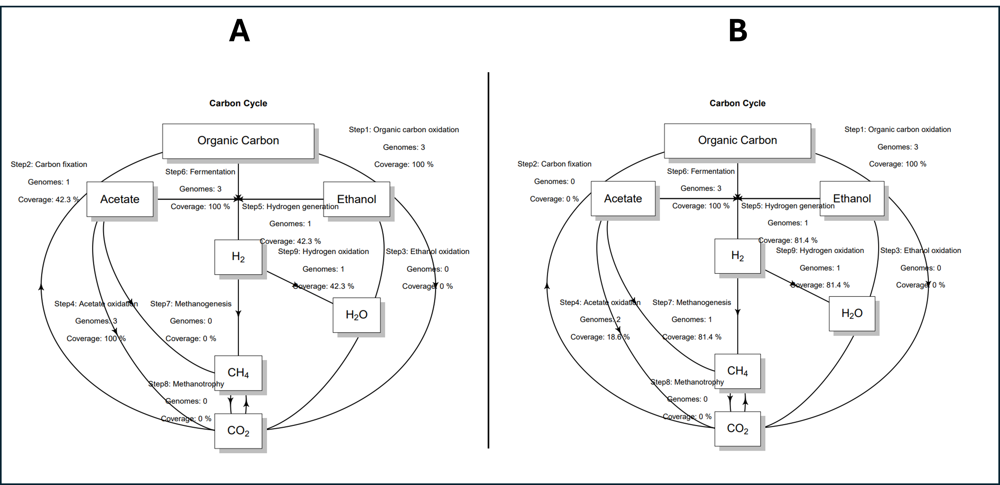

You can see that in sample A, there is a genome that is predicted to perform carbon fixation, which is not the case in B. This makes sense based on when we inspected the bins at an earlier stage for sample A:

> bin     completeness    contamination   GC      lineage N50     size  
> bin.1.orig      99.57   0.0     0.722   Streptomycetaceae       80779   8364312  
> bin.2.strict    99.72   0.0     0.554   Cyanobacteria   406760  2668992  
> bin.3.orig      98.82   1.014   0.616   Pseudomonas     112980  5996052 

You can see we have a cyanobacterium, which are known to be photosynthetic and likely responsible for the carbon fixation here. We can verify this by inspecting `METABOLIC_result.xlsx`. Sheet 2 is called `FunctionHit` and contains various functions and whether they are predicted to be present in each of the MAGs. Inspecting this data for sample A We see the following:

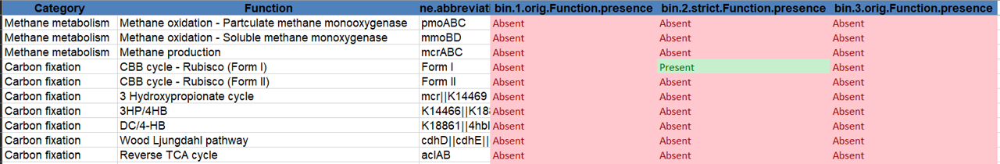

We can see that it is indeed the MAG annotated as a cyanobacterium, (bin.2.strict), that is predicted to perform carbon fixation via the CBB (Calvin) cycle - Rubisco (Form I). 


We can also see in the carbon cycle diagrams above that, in sample B, there is a genome that is predicted to perform methanogenesis, which is not the case in A. If we inspect the bins for sample B we see:
> bin     completeness    contamination   GC      lineage N50     size  
> bin.1.permissive        99.91   2.275   0.615   Pseudomonas     190794  6235225  
> bin.2.permissive        99.57   0.0     0.722   Streptomycetaceae       90075   8377728  
> bin.3.permissive        100.0   0.0     0.310   Euryarchaeota   194754  1850953

Bin 3 is annotated as belonging to the Euryarchaeota, which is a broad kingdom of archaea that include methanogens. If we go on to inspect the `FunctionHit` sheet of `METABOLIC_result.xlsx`, we see the following:

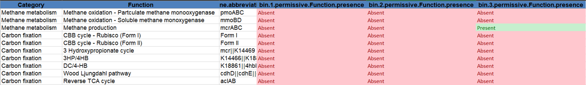

We can see that the MAG annotated as belonging to the Euryarchaeota (bin 3) contains the *mcrABC* operon, which catalyses the final step in methanogenesis. 


While this was just a quick look at the output of METABOLIC, there is so much more to delve in to, but that is well beyond the scope of this session. Copy over the output of `6_METABOLIC`, particularly `METABOLIC_result.xlsx`, to your own machine using whichever method you prefer and have a look at all the different outputs it provides; check for your favourite pathways and think about how you might analyse these outputs in your own work.

---

# Summary

By this stage, you should be pretty confident in constructing MAGs from raw metagenomic sequences using the scripts you put together in this workshop, and doing some functional annotation. The main things you will need to change are the Slurm scheduler parameters to fit your own data, which will likely be a lot bigger and more complex than what we have used here. 

There is also a lot of scope to do far more with `Metawrap` than what we did here. For example, you can use the `Quant_bins` module:
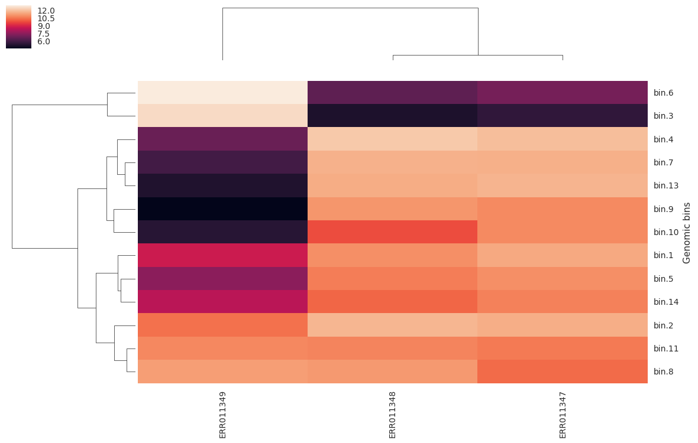

or visualise the communities in each sample using the `blobology` module:
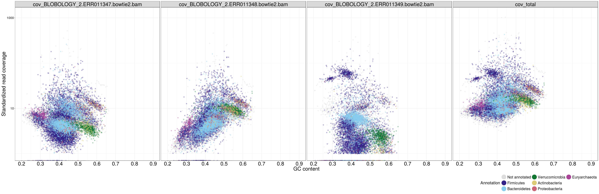

Whatever it is you do, always refer to the documentation for [Metawrap](https://github.com/bxlab/metaWRAP/blob/master/Usage_tutorial.md) and [METABOLIC](https://github.com/AnantharamanLab/METABOLIC/wiki) when using them to analyse your data, they are your best guides.


# 
# 
# Additional notes

## Installing your own instance of miniconda3

**If you want to manage your own version of miniconda, so that you can have more control, follow the steps below**

Details on how to install miniconda are available [here](https://docs.anaconda.com/free/miniconda/#quick-command-line-install)

Below is the quick version pasted from the above link. Make sure to navigate to your home directory first by typing `cd` and hitting Enter, which will take you to your home directory.

Install miniconda:
```bash
mkdir -p ~/miniconda3
wget https://repo.anaconda.com/miniconda/Miniconda3-latest-Linux-x86_64.sh -O ~/miniconda3/miniconda.sh
bash ~/miniconda3/miniconda.sh -b -u -p ~/miniconda3
rm -rf ~/miniconda3/miniconda.sh
~/miniconda3/bin/conda init bash

```


If this is the first time you have used conda on Maxwell, you will need to **restart your session by logging out and back in.** 

### Adding channels

You will then need to add some extra channels (repositories to search for packages), in order to be able to create the environments:
```bash
conda config --add channels conda-forge
conda config --add channels bioconda
```

It is also recommended to install Mamba, a conda 'drop-in' replacement, before creating the environments to speed things up:
```bash
conda install -y mamba
```


At this point you might normally start creating your environments with the software packages and dependencies that you intend to use. However, Metawrap and METABOLIC are a bit complicated and rely on setting some paths to databases as well as running some setup scripts, which would take too long to do here. A separate Markdown document (@ name.md) is provided for those who wish to do this themselves at a later date.